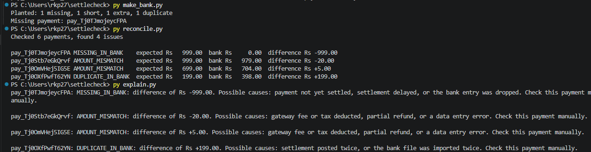

# settlecheck
# SettleCheck: AI Settlement Reconciliation Assistant

Built for Razorpay's AI Buildathon, Track 4 (AI Finance Controller).

# The problem
A merchant sees payments in Razorpay, but the money that reaches their bank often doesn't match: a payment goes missing, an amount is short or over, or an entry shows up twice. Checking this by hand in spreadsheets is slow and easy to get wrong.

# What SettleCheck does
1. Fetches captured payments from Razorpay (test mode) using their Python SDK.
2. Compares them with a bank record and flags every mismatch: missing, amount mismatch, duplicate, or unknown entry.
3. Writes a plain-English explanation for each issue, with likely causes and one thing to check.

# How it works
| Script | What it does |
|---|---|
| `fetch_payments.py` | Pulls captured test payments from Razorpay into `data/payments.csv` |
| `make_bank.py` | Builds a simulated bank file from those payments and plants known mistakes |
| `reconcile.py` | Compares both files and writes the mismatches to `data/issues.csv` |
| `explain.py` | Explains each mismatch in plain English and saves `data/report.txt` |

The bank side is simulated because Razorpay's test mode has no real bank. Planting known mistakes lets me check that the tool catches all of them.

# Run it
Requires Python 3.

```
py -m pip install razorpay
```

Set your Razorpay **test-mode** keys in the terminal (never put them in code):

```
$env:RAZORPAY_KEY_ID="rzp_test_..."
$env:RAZORPAY_KEY_SECRET="your-secret"
```

Then run the steps in order:

```
py fetch_payments.py
py make_bank.py
py reconcile.py
py explain.py
```

Expected result with the sample data: 4 issues found (1 missing, 1 Rs 20 short, 1 Rs 5 over, 1 duplicate).

# AI explanations
`explain.py` has two modes. With no API key it uses fixed explanation templates. With an `ANTHROPIC_API_KEY` set (and `py -m pip install anthropic`), it asks an AI model to explain each issue, giving it only the mismatched row and a short list of allowed causes, and telling it to say "unclear" instead of guessing.

# Screenshot


# Limitations
- Bank data is simulated, not a real bank statement.
- Test mode only; no real money is involved.
- Matching is by payment ID, so it won't catch records with missing or altered IDs.

# Tech
Python, Razorpay Python SDK (test mode).